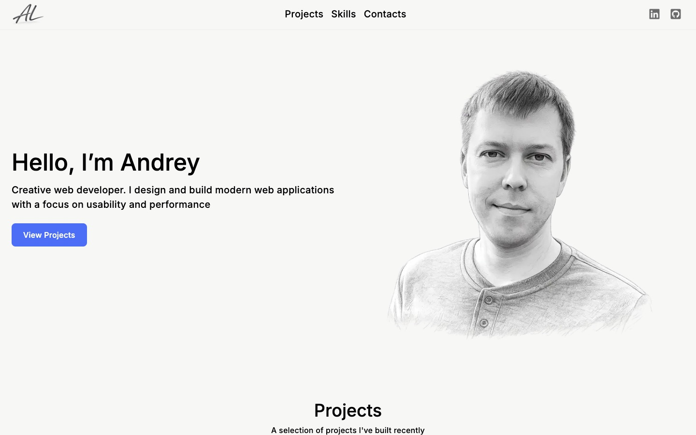
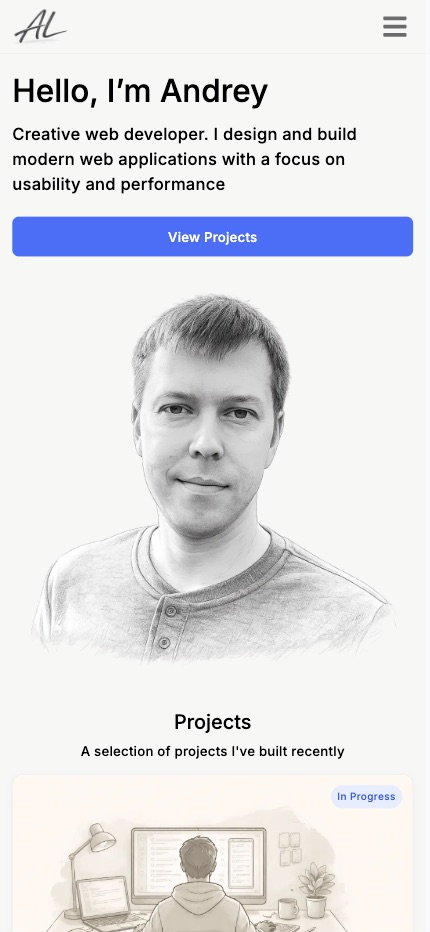

# Portfolio Website

Personal portfolio website built with Next.js and Tailwind CSS to showcase projects, frontend skills, and responsive web design.

## Live Demo

🌐 https://alyamkin.ca

## Features

- Responsive design for desktop, tablet, and mobile
- Modern UI with clean layout and typography
- Project showcase section
- Skills section
- Smooth animations and hover effects
- Optimized performance and SEO
- Accessible semantic HTML

## Tech Stack

- Next.js
- React
- TypeScript
- Tailwind CSS
- Vercel

## Screenshots

### Desktop



### Mobile



## Getting Started

Clone the repository:

```bash
git clone https://github.com/alyamkin/portfolio-web.git
```

Install dependencies:

```bash
npm install
```

Run the development server:

```bash
npm run dev
```

Open http://localhost:3000 in your browser.

## Project Structure

```bash
src/
 ├── app/
 ├── components/
 │   ├──layout/
 │   ├──sections/
 │   └──ui/
 ├── public/
 ├── styles/
 └── assets/
```

## Performance

- Optimized images with Next.js Image
- Responsive layouts
- Lighthouse performance optimizations
- Fast loading and smooth interactions

## Future Improvements

- Dark mode

## Author

Andrey Lyamkin

- GitHub: https://github.com/alyamkin
- LinkedIn: https://www.linkedin.com/in/andreylyamkin/
